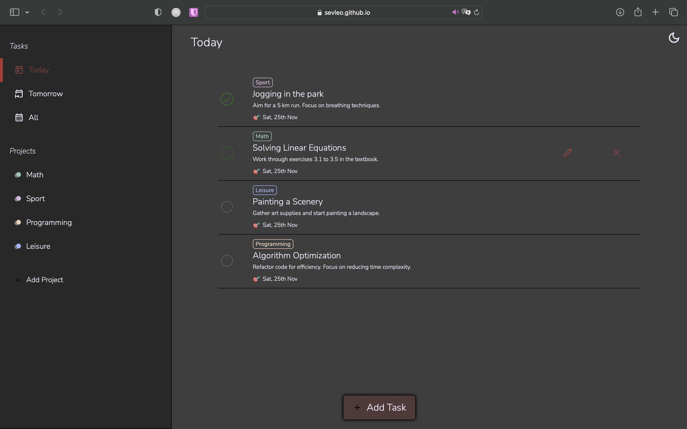

# Nova Task

Nova Task reimagines the classic todo list app with a fresh perspective, offering seamless animations and an intuitive user interface.

## Table of Contents

- [Features](#features)
- [Demo](#demo)
- [Technologies used](#technologies)
- [Limitations](#limitations)
- [Contributing](#contributing)
- [License](#license)

## Features

- Task Organization: Arrange tasks within projects for better management.
- Smart Filtering: Combine time and project filters to quickly find relevant tasks.
- Effortless Task Management: Add, delete, or edit tasks with ease.
- Web Storage API Integration: Ensures a smooth user experience by locally storing data in the browser.
- Sleek Animations: Enjoy a visually engaging experience through seamless animations.
- Day/Night Modes: Switch between light and dark themes for enhanced usability in different environments.

## Demo

You can view the project at [Nova Task Demo](https://sevleo.github.io/nova_task/).

## Technologies

- Vanilla JS
- CSS
- HTML (boilerplate only)
- Webpack
- Web Storage API
- date-fns

## Limitations
- Mobile experience not fully supported

## Contributing

 Contributions are enthusiastically welcomed! Whether you're keen on improving mobile responsiveness, enhancing UI/UX elements, or optimizing performance, follow these guidelines to contribute:

 1. Fork the repository.
 2. Create a new branch for your feature or bug fix.
 3. Make your changes and commit them.
 4. Push your changes to your fork.
 5. Create a pull request.

## License

 This project is licensed under the [MIT LICENSE](./LICENSE)